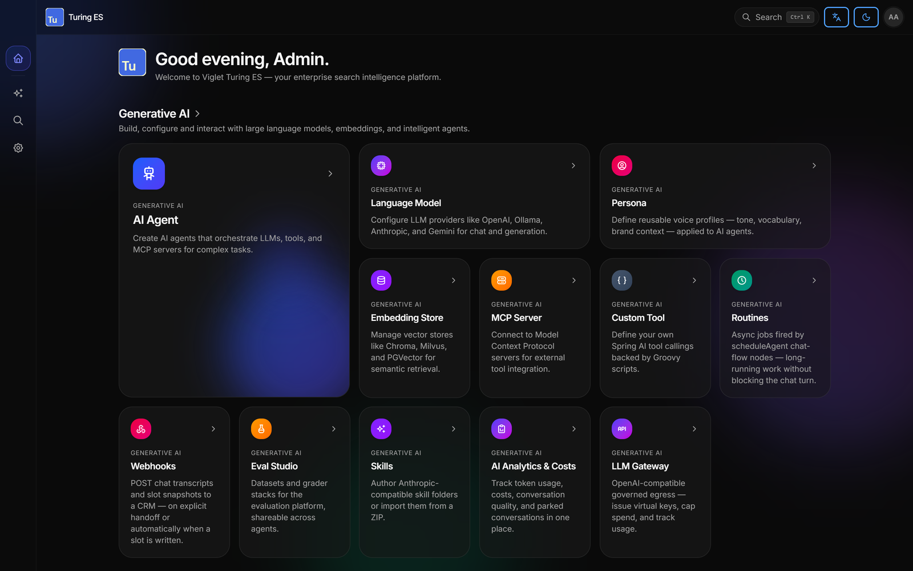

= Viglet Turing ES — Community Edition
Viglet Team <opensource@viglet.org>
:organization: Viglet Turing
:viglet-version: 2026.3
:icons: font
:git-project: openviglet/turing-ce
:toc: macro
:toclevels: 2

[.lead]
**Open-source enterprise search and generative AI platform.** Faceted semantic search, hybrid BM25 + vector ranking, RAG chat with citations, AI agents and MCP tools — running on Apache Solr, Elasticsearch or embedded Lucene, entirely on your own infrastructure. Content reaches Turing from Adobe AEM, WordPress, databases and files through the companion https://github.com/openviglet/dumont[Viglet Dumont] connectors.

image:https://img.shields.io/github/v/release/openviglet/turing-ce?style=flat-square&logo=github&label=release&color=2563eb[Latest release,link="https://github.com/openviglet/turing-ce/releases/latest"]
image:https://img.shields.io/badge/license-Apache%202.0-blue?style=flat-square&logo=apache[License,link="LICENSE"]
image:https://img.shields.io/badge/ghcr.io-openviglet%2Fturing--ce-2563eb?style=flat-square&logo=docker&logoColor=white[Container image,link="https://github.com/orgs/openviglet/packages/container/package/turing-ce"]
image:https://img.shields.io/badge/Java-21-orange?style=flat-square&logo=openjdk&logoColor=white[Java 21]
image:https://img.shields.io/badge/Spring%20Boot-4-6DB33F?style=flat-square&logo=springboot&logoColor=white[Spring Boot 4]
image:https://img.shields.io/badge/React-19-61DAFB?style=flat-square&logo=react&logoColor=black[React 19]
image:https://img.shields.io/badge/docs-docs.viglet.org-brightgreen?style=flat-square&logo=readthedocs&logoColor=white[Documentation,link="https://docs.viglet.org/turing/"]
image:https://img.shields.io/badge/discussions-join-8b5cf6?style=flat-square&logo=github[Discussions,link="https://github.com/openviglet/turing-ce/discussions"]

toc::[]

== Try it in 60 seconds

[source,bash]
----
docker run -p 2700:2700 -e TURING_ADMIN_PASSWORD=admin \
  ghcr.io/openviglet/turing-ce:latest
----

Then open **http://localhost:2700/console** and log in with `admin` / `admin`.
No external search engine, no vector database and no API key required to start —
Turing ships an embedded Lucene index and works fully offline until you decide to
plug in Solr, Elasticsearch or an LLM.

[TIP]
====
**Getting content in.** Turing indexes whatever you post to its indexing API, so
you can push documents directly from your own code. For turnkey extraction from
Adobe AEM, WordPress, databases, filesystems and web crawls, run
https://github.com/openviglet/dumont[**Viglet Dumont**] — the companion data
extraction platform that crawls those sources and feeds this index. Walkthrough:
https://turing.viglet.org/aem-search[enterprise search for Adobe AEM].
====

== Why Turing ES?

Most teams that outgrow the CMS's built-in search face the same choice: rebuild
search in-house, or send their content to a hosted vendor. Turing is the third
option — a complete, self-hosted search platform you run yourself.

[cols="1,1,1",options="header"]
|===
| | **Turing ES (Community)** | Hosted search SaaS

| Where content lives
| Your servers — indexes, embeddings and query logs never leave
| Vendor cloud

| Search backend
| Pluggable: Solr, Elasticsearch, or embedded Lucene
| Proprietary, fixed

| LLM for RAG
| Your choice — OpenAI, Anthropic, Gemini, Mistral, Cohere, Bedrock, or local Ollama
| Vendor's model, or none

| Cost model
| Apache 2.0 — no per-query, per-record or per-seat metering
| Metered by records / queries / seats

| Extensibility
| Source-available; custom search-engine plugins, agent tools and MCP servers
| Plugin marketplace

| Regulated / air-gapped deploys
| Supported — runs fully offline
| Usually not an option
|===

== What's inside

[cols="1,3",options="header"]
|===
| Capability | Description

| **Semantic Navigation**
| Faceted search, spotlights, targeting rules, autocomplete, ranking rules, multi-language

| **Hybrid ranking**
| BM25 keyword + kNN vector retrieval fused with Reciprocal Rank Fusion, plus pluggable rerankers

| **Generative AI (RAG)**
| Streaming LLM answers grounded in your indexed content, with inline source citations

| **AI Agents**
| Assistants with their own LLM, native provider tools (web search, code execution), and MCP servers

| **Multi-engine**
| One API over Apache Solr, Elasticsearch, or embedded Apache Lucene — swap without rewriting

| **Indexing API**
| Push documents over REST/JSON, in single or bulk/batch feeds, with a versioned field manifest (schema-as-code)

| **Connectors**
| Adobe AEM, WordPress, databases, filesystem and web crawls are handled by https://github.com/openviglet/dumont[**Viglet Dumont**], the companion extraction platform that feeds this index

| **File parsing**
| Apache Tika extraction for PDF and Office files uploaded to Turing or attached in chat

| **Admin console**
| React 19 console for sites, fields, facets, agents, prompts and analytics

| **APIs & SDKs**
| REST, GraphQL, SSE streaming — Java SDK (Maven Central) and JS/TS SDKs (npm)
|===

== Architecture at a glance

Turing is the search and AI layer. Extraction from content sources is a separate,
optional product — **Viglet Dumont** — so you can also feed the index straight
from your own application.

[source]
----
    Content sources          Viglet Dumont            Viglet Turing ES            Your apps
  ┌─────────────────┐      ┌───────────────┐      ┌──────────────────────┐    ┌───────────────┐
  │ Adobe AEM       │      │  Connectors   │      │  Indexing API        │    │ Site search   │
  │ WordPress       │─────▶│  Extraction   │─────▶│  Semantic Navigation │───▶│ RAG chat      │
  │ Databases       │      │  Scheduling   │      │  Hybrid BM25 + kNN   │    │ Admin console │
  │ Filesystem      │      │  Deltas       │      │  RAG · Agents · MCP  │    │ Your own app  │
  │ Web crawl       │      └───────────────┘      └──────────┬───────────┘    │ REST /GraphQL │
  └─────────────────┘                                        │                └───────────────┘
                                                             │
     Your own app ──────── POST /api/sn/import ─────────────┤
                           (skip Dumont entirely)            │
                                              ┌──────────────┴──────────────┐
                                              │ Apache Solr · Elasticsearch │
                                              │  · embedded Apache Lucene   │
                                              └─────────────────────────────┘
----

* **https://github.com/openviglet/dumont[Viglet Dumont]** — connectors, crawling, scheduling and delta detection for the sources above (this is where the AEM and WordPress integrations live).
* **Viglet Turing ES** (this repository) — indexing, ranking, faceting, RAG, agents and the admin console.

== Installation

=== Docker Compose (full stack)

[source,bash]
----
git clone https://github.com/openviglet/turing-ce.git
cd turing-ce
docker compose up -d
----

=== Build from source

Requires **Java 21+** and **Maven 3.6+** (the `./mvnw` wrapper is included).

[source,bash]
----
git clone https://github.com/openviglet/turing-ce.git
cd turing-ce
./mvnw clean install
java -jar turing-app/target/viglet-turing.jar
----

=== Kubernetes

Manifests are in link:k8s/[`k8s/`]; a single-file deployment is in link:k8s.yaml[`k8s.yaml`].

Packaged installers (Windows `.exe`, `.zip`, Linux AppImage) are attached to every
https://github.com/openviglet/turing-ce/releases[release].

== Code examples

=== REST API

[source,bash]
----
# Faceted search
curl "http://localhost:2700/api/sn/sample-site/search?q=enterprise+search&rows=10&_setlocale=en_US"

# Autocomplete
curl "http://localhost:2700/api/sn/sample-site/ac?q=enterp&_setlocale=en_US"

# RAG chat (SSE stream, answers with citations)
curl "http://localhost:2700/api/sn/sample-site/chat?q=What+is+enterprise+search"
----

=== JavaScript / TypeScript

[source,typescript]
----
import { TurSNSiteSearchService } from '@viglet/turing-react-sdk';

const search = new TurSNSiteSearchService('http://localhost:2700');
const results = await search.search('sample-site', {
  q: 'machine learning', rows: 10, localeRequest: 'en_US'
});

results.results?.document?.forEach(doc => console.log(doc.fields?.title));
----

A zero-dependency vanilla-JS build (`@viglet/turing-sdk`) is also published for
plain `<script>` tags and Adobe Edge Delivery Services blocks.

=== Java

[source,java]
----
HttpTurSNServer server = new HttpTurSNServer("http://localhost:2700/api/sn/MySite");

TurSNQuery query = new TurSNQuery();
query.setQuery("artificial intelligence");
query.setRows(10);

QueryTurSNResponse response = server.query(query);
response.getResults().getDocument().forEach(doc ->
    System.out.println(doc.getFields().get("title"))
);
----

=== GraphQL

[source,graphql]
----
query {
  siteSearch(
    siteName: "sample-site"
    searchParams: { q: "technology", rows: 10, p: 1 }
    locale: "en_US"
  ) {
    queryContext { count, responseTime }
    results { document { fields { title, text, url } } }
  }
}
----

Interactive GraphiQL IDE at http://localhost:2700/graphiql.

== Project structure

[source]
----
turing-ce/
├── turing-app/           # Spring Boot 4 backend (Java 21)
├── frontend/             # pnpm + Turborepo monorepo
│   ├── apps/turing-app/  #   React 19 + TypeScript admin console (Vite, shadcn/ui)
│   ├── apps/marketplace/ #   example applications
│   └── packages/         #   SDKs: react-sdk, sdk (vanilla JS), react-ui, shared-types
├── turing-commons/       # Shared library
├── turing-spring/        # Shared Spring library
├── turing-java-sdk/      # Java SDK
├── turing-marketplace/   # Marketplace packages
├── turing-utils/         # Utilities
├── containers/           # Container build assets
├── k8s/                  # Kubernetes manifests
└── docker-compose.yaml   # Docker Compose stack
----

== Documentation

[cols="1,2"]
|===
| https://docs.viglet.org/turing/[docs.viglet.org/turing] | Architecture, configuration, connectors, admin guide
| https://turing.viglet.org/aem-search[AEM search guide] | Adding enterprise search + AI to Adobe Experience Manager
| link:docs/RAG_HYBRID_CONFIG.md[Hybrid RAG configuration] | Tuning BM25 + vector retrieval and rerankers
| link:docs/MULTI_TENANCY.md[Multi-tenancy] | Running one instance for many tenants
| https://github.com/orgs/openviglet/packages/container/package/turing-ce[GHCR container] | `ghcr.io/openviglet/turing-ce`
| link:CHANGELOG.md[Changelog] | What shipped in each release
|===

== Contributing

Contributions are genuinely welcome — bug reports, docs, search-engine plugins,
agent tools and code.

* 🐛 **Found a bug?** https://github.com/{git-project}/issues/new?template=bug_report.md[Open an issue]
* 💡 **Have an idea?** https://github.com/{git-project}/issues/new?template=feature_request.md[Request a feature]
* 💬 **Questions or ideas?** https://github.com/{git-project}/discussions[Join the Discussions]
* 🚀 **Want to code?** Read link:CONTRIBUTING.md[CONTRIBUTING.md] and open a pull request

[NOTE]
.About this repository's history
====
`turing-ce` is the **public distribution** of Viglet Turing ES: development
happens in an internal repository and each release is published here as one
clean, reviewed snapshot commit. That is why the log shows one commit per
release rather than a day-by-day history.

**It does not change how you contribute.** Issues and pull requests are opened,
reviewed and discussed *here*. Accepted changes are integrated upstream and ship
in the next release, with your authorship and sign-off preserved in the PR
record. Every release commit carries the full list of changes in its message,
and the https://github.com/{git-project}/releases[release notes] spell them out.
====

== Community & support

* 💬 https://github.com/{git-project}/discussions[GitHub Discussions] — questions, ideas, show-and-tell
* 🔒 link:SECURITY.md[Security policy] — please report vulnerabilities privately
* 🤝 link:CODE_OF_CONDUCT.md[Code of Conduct]
* 🆘 link:SUPPORT.md[Support options]

If Turing ES is useful to you, **⭐ starring the repository** genuinely helps
other teams find it.

== License

Apache License 2.0 — see link:LICENSE[LICENSE]. You can use, modify and deploy
Turing ES commercially, including in closed-source products.

---

[.text-center]
Built by the https://viglet.org[Viglet] Team · https://turing.viglet.org[turing.viglet.org]
